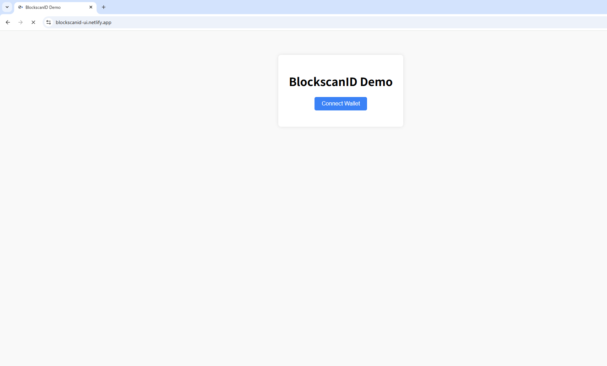

# BlockscanID Token (BID)

> 🧪 Experimental prototype for identity-token UX design in the Blockscan ecosystem.

---

## 🔍 Overview

**BlockscanID Token (BID)** is a functional proof-of-concept for identity-layer UX using ENS, wallet binding, and token-based claims — built around the reserved ENS domain `blockscanid.eth`.

This project is **not affiliated** with Blockscan, Etherscan, or any official entity.  
It exists to demonstrate possibilities for secure identity anchoring and wallet-based interactions via ENS infrastructure.

---

## 💡 Potential Use Cases

- **Verified Wallet ID Binding**  
  Link wallets to sub-identities like `user.blockscanid.eth` to enable recognizability across apps.

- **ENS-integrated Session Tokens**  
  Use for ephemeral or delegated identities within dapps using Etherscan APIs.

- **Credential Anchoring & ZK**  
  Provide a foundation for future credentials or attestations (ZK or signature-based).

---

## 🛠 Live Demo & Assets

- ENS: [`blockscanid.eth`](https://app.ens.domains/name/blockscanid.eth)
- UI Demo: [https://blockscanid-ui.netlify.app](https://blockscanid-ui.netlify.app)
- Source: [GitHub](https://github.com/your-org/blockscanid-prototype)

> ENS `text-record` is configured to point to this repository for transparency.

---

## 📦 Tech Stack

| Component     | Tech                          |
|---------------|-------------------------------|
| Smart Contract| ERC-20 via OpenZeppelin       |
| Frontend      | React + TailwindCSS + Ethers.js |
| Hosting       | Netlify                       |
| ENS Support   | Reverse resolution + Records  |

---

## 🛡 Disclaimer

This is a public prototype project, published under MIT license.  
There is no affiliation with Blockscan, Etherscan, or any known entity.

Wallet connection is handled locally by the user via MetaMask.  
No personal data is collected or processed. This is a frontend-only prototype.

---

## 📩 Contact

This domain is currently reserved to prevent unauthorized usage and brand confusion.  
If you are a verified party working on the Blockscan or identity ecosystem and wish to coordinate, please refer to the contact information stored in the ENS `text-record`.

---
