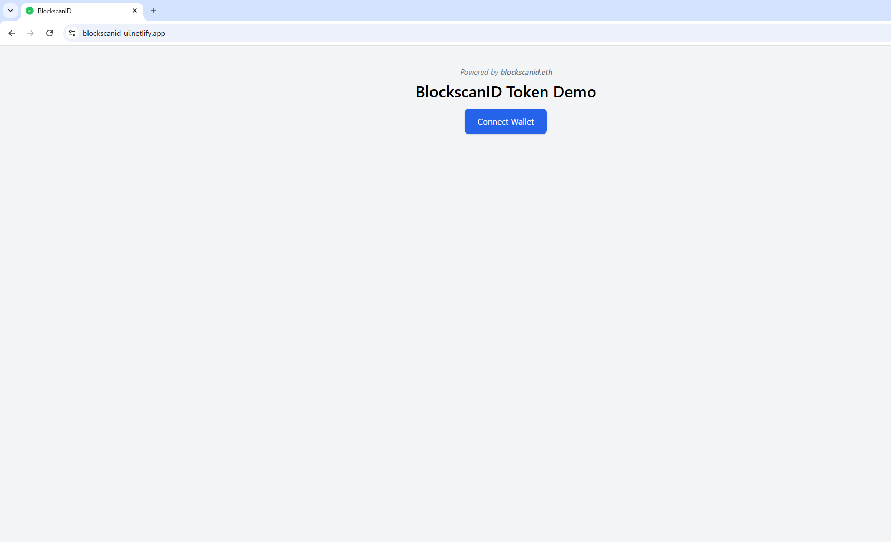

# BlockscanID Token (BID)

**This is a non-official prototype created to explore a potential identity-token structure for Blockscan ecosystem participants.**

## 🔍 Overview

BlockscanID Token (BID) is a mock implementation of an ERC-20 token intended for experimentation, testing, and UX exploration around identity-linked utilities within the Blockscan L2 ecosystem.

## ⚙️ Technical Stack
- ERC-20 Standard (OpenZeppelin)
- Deployed via Remix or Hardhat
- UI demo hosted on Netlify (React + Ethers.js)

## 🔒 Legal & Attribution
This is an open prototype not affiliated with Blockscan. MIT licensed. The ENS `blockscanid.eth` is configured to point to this repo via text record.

## 👋 Contact
If you're from Blockscan and would like to discuss or acquire blockscanid.eth, feel free to reach out via the email address provided in the ENS text record.
---

## 🔗 ENS Integration

- ENS name: `blockscanid.eth`
- Demo subdomain: `demo.blockscanid.eth`
- Live demo: [https://blockscanid-ui.netlify.app](https://blockscanid-ui.netlify.app)

## 🖼️ UI Preview

The following screenshot shows the live demo interface:

